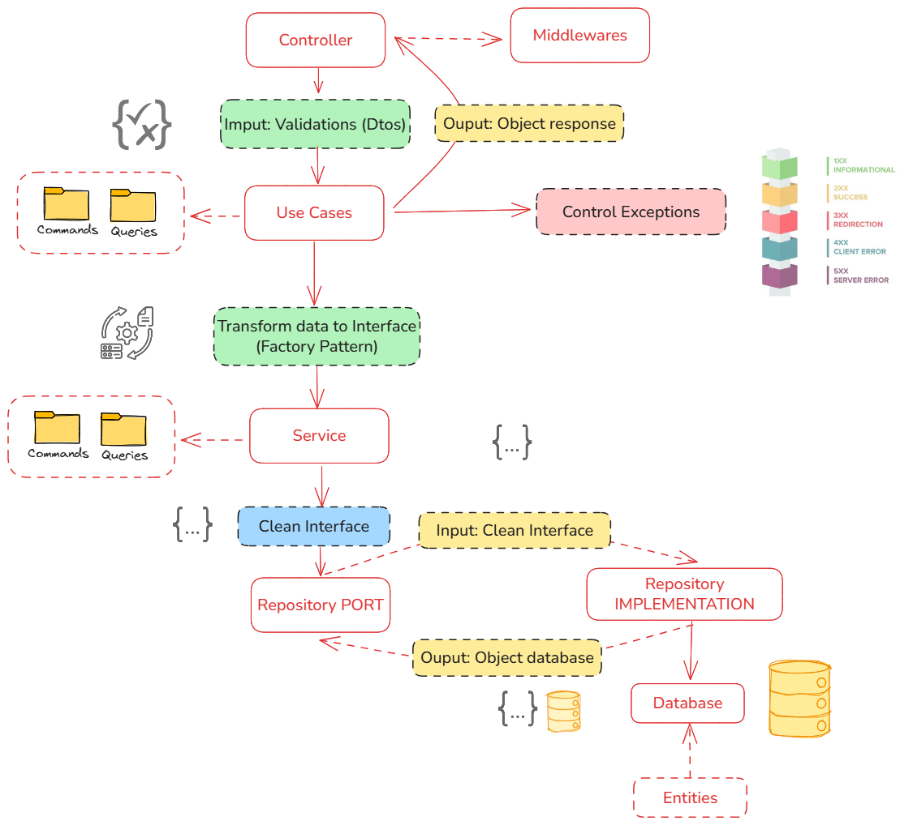

# Hexa-Mod 🛠️

**Hexa-Mod** es una herramienta diseñada para generar módulos con arquitectura hexagonal en proyectos NestJS. Esta herramienta automatiza la creación de la estructura de carpetas y archivos necesarios, siguiendo las mejores prácticas de desarrollo.



---

## Características ✨

- **Generación automática de módulos**: Crea la estructura de carpetas y archivos necesarios para un módulo con arquitectura hexagonal.
- **Validación de dependencias**: Verifica si NestJS está instalado en el proyecto antes de generar el módulo.
- **Fácil de usar**: Solo necesitas ejecutar un comando para generar un módulo completo.

---

## Requisitos

Asegurate de haber inicializado tu aplicacion con Nestjs, caso contrario no te dejara ejecutar los comando.

## Instalación 📦

Para instalar **hexa-mod**, ejecuta el siguiente comando:

```bash
npm install hexa-mod
```

## Generación de módulos 📦

Para generar un módulo debe ejecutar el siguiente comando

```bash
npx hexa-mod <nombre-del-modulo>
```

## Formato de carpetas

```
└── 📁user
    └── 📁application
        └── 📁dtos
            ├── user-create-request.dto.ts
            ├── user-create-response.dto.ts
            ├── user-update-request.dto.ts
            ├── user-update-response.dto.ts
        └── 📁use-cases
            └── 📁commands
                ├── user-create.use-case.ts
                ├── user-delete.use-case.ts
                ├── user-update.use-case.ts
            └── 📁queries
                ├── user-find-all.use-case.ts
                ├── user-find-one.use-case.ts
    └── 📁config
        ├── user.config.ts
        ├── user.module.ts
    └── 📁domain
        └── 📁entities
            ├── user.entity.ts
        └── 📁factories
            ├── user.factory.ts
        └── 📁interfaces
            ├── user-create.interface.ts
            ├── user-update.interface.ts
        └── 📁services
            └── 📁commands
                ├── user-create.service.ts
                ├── user-delete.service.ts
                ├── user-update.service.ts
            └── 📁queries
                ├── user-find-all.service.ts
                ├── user-find-one.service.ts
    └── 📁infrastructure
        └── 📁adapters
            └── 📁implements
                ├── user-repository.impl.ts
            └── 📁ports
                ├── user-repository.port.ts
        └── 📁controllers
            ├── user.controller.ts
        └── middlewares
```
